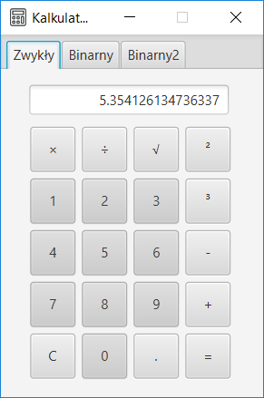
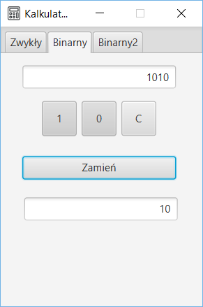
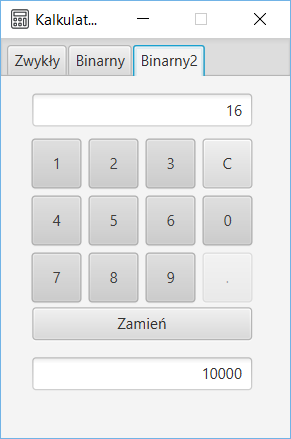

# FXCalculator
   This is my first project with <b>JavaFX</b>, <s>not so</s> simple calculator. 
   As you can see in screenshots below, except normal calculations you can convert numbers from and for binary version. 
   I also use regular expression <b>RegEx</b> for problems with decimal point, thanks this you can't put more than 1 point in number, when    textField with calculations is empty and you try to put decimal point it'll automatically add 0 before (0.). 

## Technologies:
   <ul>
       <li>Java: version 8.0</li>
       <li>JavaFX: version 8.0.141</li>
   </ul>

## Screenshots
   
